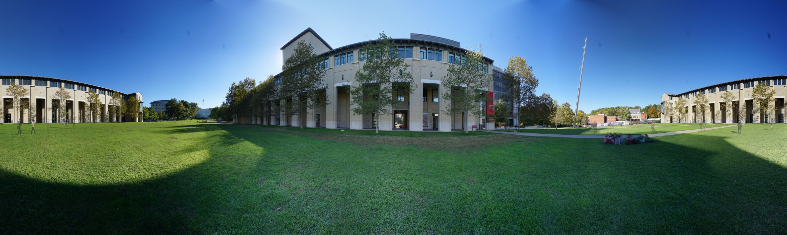
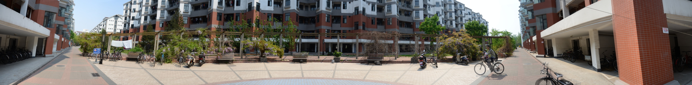
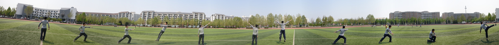
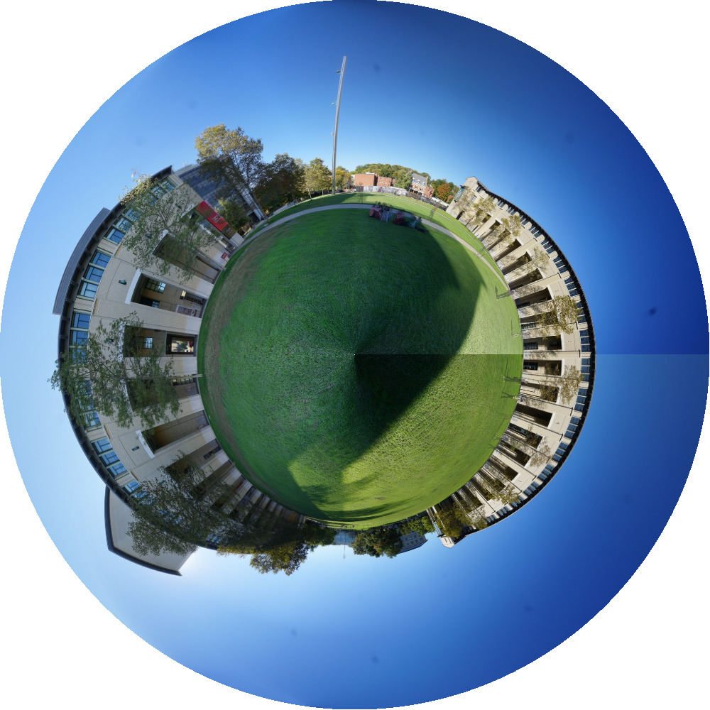
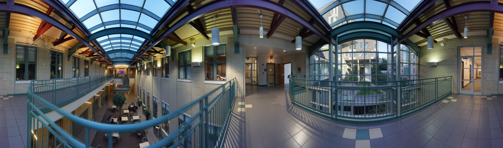
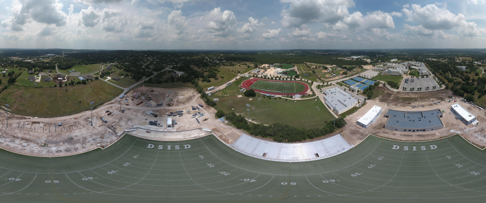

# OpenPano



## Introduction

OpenPano is a panorama stitching program written in C++ from scratch (without any vision libraries). It mainly follows the routine
described in the paper [Automatic Panoramic Image Stitching using Invariant Features](http://matthewalunbrown.com/papers/ijcv2007.pdf),
which is also the one used by [AutoStitch](http://matthewalunbrown.com/autostitch/autostitch.html).

[](https://travis-ci.org/ppwwyyxx/OpenPano)

### Compile Dependencies:

* gcc >= 4.7 (Or VS2015)
* [Eigen](http://eigen.tuxfamily.org/index.php?title=Main_Page)
* [FLANN](http://www.cs.ubc.ca/research/flann/) (already included in the repository, slightly modified)
* [CImg](http://cimg.eu/) (optional. already included in the repository)
* libjpeg (optional if you only work with png files)
* cmake or make

Eigen, CImg and FLANN are header-only, to simplify the compilation on different platforms.
CImg and libjpeg are only used to read and write images, so you can easily get rid of them.

On ArchLinux, install dependencies by: `sudo pacman -S gcc sed cmake make libjpeg eigen`

On Ubuntu, install dependencies by: `sudo apt install build-essential sed cmake libjpeg-dev libeigen3-dev`

### Compile:
#### Linux / OSX / WSL (bash on windows)
```
$ make -C src
```
or
```
$ mkdir build && cd build && cmake .. && make
```
The default clang on OSX doesn't contain openmp support.
You may need gcc or different clang. See #16.


#### Windows
* Install cmake, VS2015
* Set environment variable `Eigen3_DIR` to `{YOUR_EIGEN3_DIRECTORY}/eigen3/cmake`.
* Open Visual Studio [Developer Command Prompt](https://msdn.microsoft.com/en-us/library/ms229859(v=vs.110).aspx).
* `cd path/to/OpenPano`
* `cmake .`
* Open the VS2015 project and compile the project
* copy `config.cfg` to the directory containing `image-stitching.exe`
* The author have never used Visual Studio and this windows build process may not work for you. Feel
	free to submit PR to improve the build process.

### Options:

Three modes are available (set/unset the options in ``config.cfg``):
+ __cylinder__ mode. Give better results if:
	+ You are __only__ turning left (or right) when taking the images (as is usually done), no
		translations or other type of rotations allowed.
	+ Images are taken with the same camera, with a known ``FOCAL_LENGTH`` set in config.
	+ Images are given in the left-to-right order. (I might fix this in the future)

+ __camera estimation mode__. No translation is the only requirement on cameras.
  It can usually work well as long as you don't have too few images.
  But it's slower because it needs to perform pairwise matches.

+ __translation mode__. Simply stitch images together by affine transformation.
  It works when camera performs pure translation and scene points are roughly at the same depth.  It also requires ordered input.

Some options you may care:
+ __FOCAL_LENGTH__: focal length of your camera in [35mm equivalent](https://en.wikipedia.org/wiki/35_mm_equivalent_focal_length). Only useful in cylinder mode.
+ __ORDERED_INPUT__: whether input images are ordered sequentially. has to be `1` in CYLINDER and TRANS mode.
+ __CROP__: whether to crop the final image to avoid irregular white border.

Other parameters are quality-related.
The default values are generally good for images with more than 0.7 megapixels.
If your images are too small and cannot produce satisfactory results,
it might be better to resize your images rather than tune the parameters.

### Run:

```
$ ./image-stitching <file1> <file2> ...
```

The output file is ``out.jpg``. You can play with the [example data](https://github.com/ppwwyyxx/OpenPano/releases/tag/0.1) to start with.

Before dealing with very large images (4 megapixels or more), it's better to resize them. (I might add this feature in the future)

In cylinder/translation mode, the input file names need to have the correct order.

## Examples ([All original data available for __download__](https://github.com/ppwwyyxx/OpenPano/releases/tag/0.1)):

Zijing Apartment in Tsinghua University:


"Myselves":


<!--
   -Zijing Playground in Tsinghua University:
   -
	 -->

Carnegie Mellon University from 38 images


Newell-Simon Hall in CMU (this one is hard because objects are closer):


A full-view pano built from UAV images:


For more examples, see [results](results).

## Speed & Memory:
Tested on Intel Core i7-6700HQ, with `ESTIMATE_CAMERA` mode:

+ 11 ordered images of size 600x400: 3.2s.
+ 13 ordered images of size 1500x1112: 6s.
+ 38 unordered images of size 1300x867 (high vertical FOV): 51s.

Memory consumption is known to be huge with default libc allocator.
Simply using a modern allocator (e.g. tcmalloc, jemalloc) can help a lot.
Also, setting `LAZY_READ` to 1 can save memory at the cost of a minor slow down.

Peak memory in bytes (assume each input has the same w & h):

+ Without `LAZY_READ` option: max(finalw \* finalh \* 12, #photos \* w \* h \* 12 + #photos \* #matched\_pairs * 96 + #keypoints * 520)
+ With `LAZY_READ` option: max(finalw \* finalh \* 16, #threads \* w \* h \* 12, #photos \* #matched\_pairs * 96 + #keypoints * 520)

## Algorithms
+ Features: [SIFT](http://en.wikipedia.org/wiki/Scale-invariant_feature_transform)
+ Transformation: use [RANSAC](http://en.wikipedia.org/wiki/RANSAC) to estimate a homography or affine transformation.
+ Optimization: focal estimation, [bundle adjustment](https://en.wikipedia.org/wiki/Bundle_adjustment), and some straightening tricks.

For details, see [my blog post](http://ppwwyyxx.com/2016/How-to-Write-a-Panorama-Stitcher/).

## Quality Guidelines

To get the best stitching quality:
+ While rotating the camera for different shots, try to keep the position of camera lens static.
+ Keep the exposure parameters unchanged.
+ Do not shoot on moving objects.
+ Objects far away will stitch better.
+ The algorithm doesn't work well with wide-angle cameras where images are distorted heavily. Camera
	parameters are needed to undistort the images.

## TODOs
+ apply pairwise matching for translation mode as well
+ run bundle adjustment on sphere lens instead of perspective lens
+ improve feature detector and matching
+ use LAZY_READ & 1 byte image in both blender to reduce peak memory
+ clean up use of copies of `ImageRef`
+ faster gaussian blur kernel
+ port some hotspot (e.g. `dist.cc`) to neon
+ support read/write EXIF metadata to:
	+ get focal length, distortion, etc
	+ allow pano to be viewed on Facebook
+ python bindings
